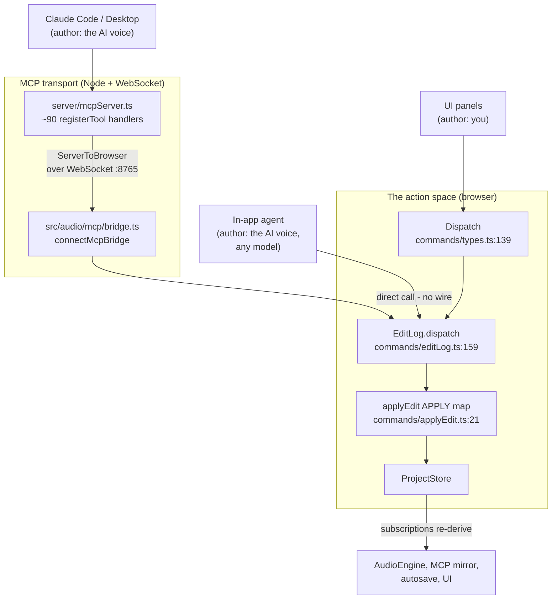
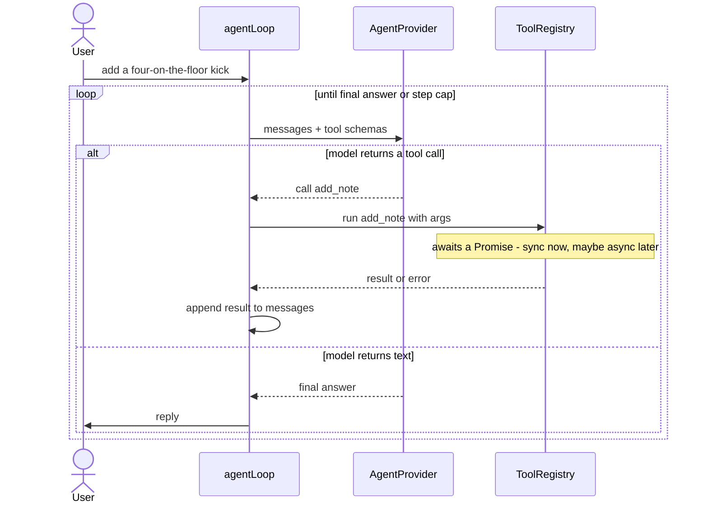
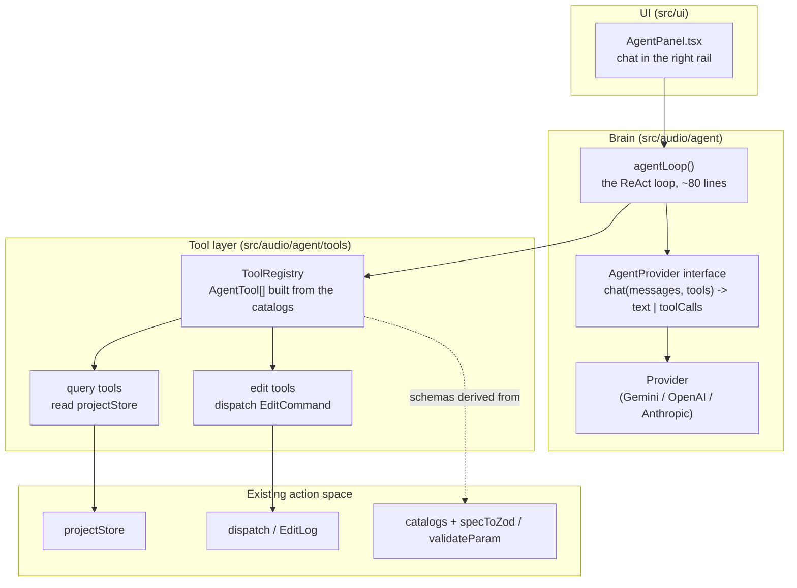
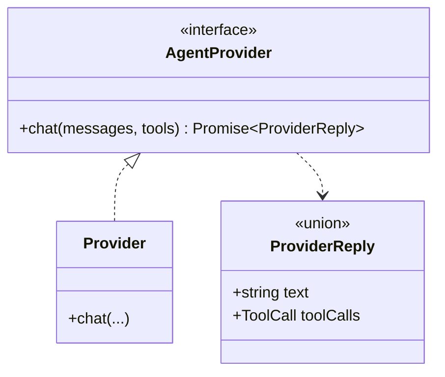
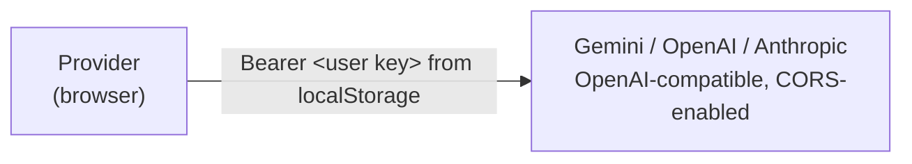
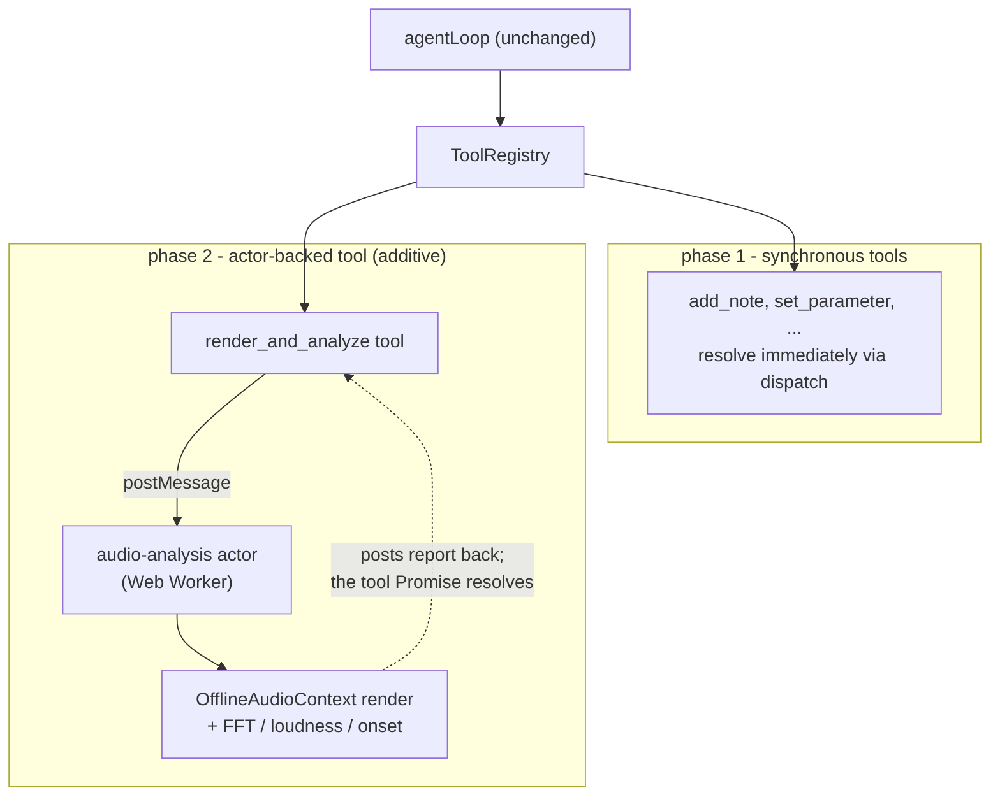

# The in-app AI agent - architecture

> **Status: design.** Nothing described here is built yet. This is the map we build
> against and update as we go, so the whole thing stays legible. Companion to
> [DESIGN.md](./DESIGN.md) (the "agent-right" direction) and
> [BRIEF.md](./BRIEF.md). No em-dash characters in this file (repo convention).

The goal is a built-in AI collaborator that lives in the reserved right rail and can
*do things* in the project - add tracks, write notes, tweak parameters - by reasoning
in a loop and calling tools. We build it in phases, smallest-useful-thing first, but
against seams chosen so that the more advanced patterns (an offline-render "ears"
subsystem, multiple cooperating agents) slot in **without a rewrite**.

Two patterns get named a lot here, so up front:

- **Action pattern (ReAct)** - the agent's *brain*. One loop: reason, call a tool,
  observe the result, repeat until done. This is phase 1.
- **Actor model** - a *concurrency architecture*: isolated units with private state
  that talk only by async messages. Not the brain; it's how we'll structure slow,
  parallel, isolated background work (rendering + analysis) in phase 2. In a browser
  we get actors nearly for free (Web Workers, AudioWorklets).

---

## The big idea: one action space, three clients

The expensive part is already built. Every durable change to a project goes through a
single command layer, and it already has two clients (the UI and Claude Code). The
in-app agent becomes a **third client of the exact same layer** - it does not get its
own parallel way to mutate the project.



Why this matters: because the agent writes through `EditLog.dispatch`, everything that
already reacts to an edit keeps working for free - undo/redo checkpoints, the activity
feed, version history, autosave, and the audio engine reconciling. The agent gets all
of that by construction, not by re-implementing it.

Key seams (real files):

- **Command vocabulary**: `EditCommand = ProtocolEdit | LocalEdit`
  ([commands/types.ts:124](../src/audio/commands/types.ts#L124)). `ProtocolEdit` is the
  durable-edit subset of the MCP wire protocol `ServerToBrowser`
  ([mcp/protocol.ts:40](../src/audio/mcp/protocol.ts#L40)), so UI and MCP cannot drift.
- **The write path**: `Dispatch` ([types.ts:139](../src/audio/commands/types.ts#L139))
  -> `EditLog.dispatch(command, author)`
  ([editLog.ts:159](../src/audio/commands/editLog.ts#L159)) -> the `APPLY` map
  ([applyEdit.ts:21](../src/audio/commands/applyEdit.ts#L21)).
- **Author**: `Author = "you" | "claude"`
  ([types.ts:15](../src/audio/commands/types.ts#L15)) drives the two-voice color. That
  color is **human-vs-AI, not vendor-vs-vendor** - the feed distinguishes "did I do
  this or did the agent," not "Claude or Gemini." So the author should be
  model-agnostic: the in-app agent is "the AI voice" regardless of which model is
  plugged in (Gemini, Claude, local). Today the only AI value is `"claude"`, so phase 1
  reuses it; the small cleanup is renaming the AI slot to something model-neutral (e.g.
  `"agent"`) and treating the specific provider as separate metadata (a tooltip, say) -
  never a second voice color. Note Claude Code is genuinely Claude, so *its* edits are
  legitimately the AI voice by that model; the in-app agent just shares the same voice.

The in-app agent does **not** touch the Node MCP server or the WebSocket. That path
exists for external clients. Our agent is in the browser, so it calls `dispatch`
directly and reads `projectStore` directly.

---

## Phase 1 - the single ReAct loop

The entire loop, stripped of mystique:



That is 90% of what Claude Code is. Provider tool-use / function-calling gives us the
"return a structured tool call" step natively, so we never parse freeform text.

### The layers we build



**1. The tool layer** - the seam that makes everything else swappable. A tool is:

```ts
interface AgentTool {
  name: string;                       // "add_note", "set_parameter", ...
  description: string;
  inputSchema: z.ZodType;             // reused from the same catalog-driven schemas MCP uses
  run(args: unknown): Promise<ToolResult>;   // ALWAYS a Promise (see invariants)
}
```

Two flavours, mirroring MCP:

- **query tools** read `projectStore` directly and return data (list_tracks,
  list_notes, list_parameters).
- **edit tools** call `dispatch(command, "claude")` and return a confirmation.

Crucially, the tool list is **derived from the same catalog functions the MCP server
iterates** - `instrumentSchema()`, `effectSchema()`, `pickableInstrumentInfos()`,
`effectInfos`, `GROOVES`, `BUILTIN_SAMPLES` - validated with
`specToZod` / `validateParam` ([params/zod.ts:20](../src/audio/params/zod.ts#L20),
[params/validate.ts:19](../src/audio/params/validate.ts#L19)). Add a new instrument to
the catalog and it appears to *both* Claude Code and the in-app agent. No second
catalog to maintain.

> **Built** (tools + loop): the [tools/](../src/audio/agent/tools/) module defines the
> set via a `defineTool` factory - each tool's one zod schema both validates the model's
> arguments and generates the provider JSON Schema (`z.toJSONSchema`). It is grouped by
> domain (`structure` = tracks + groups + selection, `clips` = notes + clip pool +
> placements, `sound` = params + effects + patches, `project` = tempo/length/loop +
> grooves + samples + transport), roughly at parity with the MCP tool surface. Read
> tools query `projectStore`; edit tools go through `dispatch(command, "agent")` (the
> agent's own voice) - the same path the UI and MCP use - so edits appear live in the
> arrangement and the activity feed, with undo/history for free. Parameter writes
> validate against the catalog schema (`validateParam`); selection + transport are live
> calls (not durable edits). The [loop.ts](../src/audio/agent/loop.ts) `runAgent`
> executes tool calls, feeds results back, and iterates to a step cap. More tools = one
> more `defineTool` entry. Verified against the live model (Gemini accepts the generated
> schemas, incl. the value union, and emits tool calls).

**2. The provider abstraction** - one narrow interface, so the model is swappable and
the loop never learns a vendor's JSON dialect.



One generic `Provider` covers Gemini, OpenAI, and Anthropic: all three expose an
OpenAI-compatible `/chat/completions` endpoint, so the only per-vendor differences (base
URL, default model, and Anthropic's browser-access header) are **data** in a small
registry, not code. If a future vendor needs a genuinely different dialect, it becomes its
own `AgentProvider` implementation behind the same `chat(messages, tools)` seam and the
loop never notices.

**3. The key: bring-your-own-key (BYOK), multi-provider.** The app is local-first and,
hosted, has no server we run - so there is nowhere to keep a shared secret, and we do not
want to pay for or police everyone's inference in v1. Instead the user brings their **own**
provider key. Every supported provider's endpoint allows CORS from the browser (verified:
Gemini and OpenAI reflect the origin; Anthropic allows it with the
`anthropic-dangerous-direct-browser-access` header), so the provider calls it **directly**
from the tab. This makes local == deployed: there is no proxy to run.

> **Built** ([providers.ts](../src/audio/agent/providers.ts) + [config.ts](../src/audio/agent/config.ts)):
> a data-driven registry of providers (id, label, base URL, default + suggested models,
> key URL, extra headers). Config in `localStorage` (`web-daw:agent-config:v2`) holds the
> selected provider plus a **key and model per provider**, so several can be saved at once
> and switched between. A Settings dialog ([AgentSettings.tsx](../src/ui/AgentSettings.tsx),
> opened from the gear at the bottom of the activity rail) has the provider selector, the
> key field, and a free-text model field (suggestions via `datalist`).
> [provider.ts](../src/audio/agent/provider.ts) reads the active provider + key and POSTs
> to its `/chat/completions` with a `Bearer` header (plus any extra headers); with no key
> it returns a friendly "open Settings" error. Keys are sent only to the chosen provider,
> never to any server we run. (An earlier dev-only Vite key-proxy has been removed in
> favour of this.)
>
> Tradeoff, named honestly: a key in `localStorage` is exposed to any XSS on our origin -
> the standard local-first risk. It is the user's own key (scoped + revocable), the
> Settings copy says where it is stored, and we never log it. A hosted "our key, metered +
> billed" option is a much larger follow-on (accounts, quotas, Stripe), not v1.



**4. The panel.** `AgentPanel` ([ui/AgentPanel.tsx](../src/ui/AgentPanel.tsx)) is a
placeholder today, mounted in the reserved grid column at
[AppShell.tsx:276](../src/ui/AppShell.tsx#L276). `AppShell` owns `dispatch`
([AppShell.tsx:64](../src/ui/AppShell.tsx#L64)) and the stores
([AppShell.tsx:56-63](../src/ui/AppShell.tsx#L56)) and already threads them into sibling
panels. Phase 1 widens `AgentPanel`'s props to receive `dispatch` + `projectStore` the
same way, and builds the `ToolRegistry` from them.

> **Built** (bare chat): [AgentPanel.tsx](../src/ui/AgentPanel.tsx) now hosts a plain
> chat driven by [useAgentChat.ts](../src/ui/useAgentChat.ts) over
> [provider.ts](../src/audio/agent/provider.ts) - the first visible end of
> the pipeline. No tools yet, so it does not receive `dispatch`/`projectStore`; those
> arrive with the `ToolRegistry`. The shared contract (`ChatMessage`, `AgentProvider`,
> `ProviderReply`) lives in [agent/types.ts](../src/audio/agent/types.ts).

---

## Phase 2 - slotting in the actor model (the "ears" and beyond)

We want the agent to *hear* what it makes: bounce the project offline, analyse the
audio (loudness, spectrum, onsets), and reason on the result. That work is slow, has
big isolated state (render buffers), and is naturally parallel (render A/B/C at once) -
which is exactly what the actor model is for. In the browser, an actor is a **Web
Worker**.

The payoff of the phase-1 seams: this is **purely additive**. The loop does not change.



From the loop's view, `render_and_analyze` is just another tool that returns a Promise -
it happens to resolve later, when the Worker posts its analysis back. The **tool boundary
is the seam**: ReAct on the brain side, an actor on the sensory side, joined by one async
tool call. Existing infra to build on: `OfflineAudioContext`
([waveform.ts:88](../src/audio/waveform.ts#L88)) already renders offline for waveforms,
and the `capture-processor` worklet ([worklets/capture.worklet.ts](../src/audio/worklets/capture.worklet.ts))
is the closest existing audio-tap.

The same seam covers **multi-agent** work later: a sub-agent or a "listener/critic" is
just another async tool the parent loop awaits (its own `agentLoop` with a scoped goal
and tool subset). We only reach for it once one loop is straining against context or
tool count - not before.

---

## Design invariants (what keeps the actor model a drop-in)

These are the promises phase 1 must keep so phase 2 is additive, not a rewrite:

1. **Every tool returns a `Promise`.** Even trivially-synchronous ones. The loop always
   `await`s, so a tool can later be backed by a Worker with zero loop changes.
2. **The tool boundary is the only seam the loop knows.** The loop never reaches past a
   tool into a store, a worker, or a sub-agent. Swap what is behind a tool freely.
3. **Provider access is one narrow interface.** `chat(messages, tools)`. Vendor dialects
   live inside a provider, never in the loop.
4. **The agent writes through the existing `dispatch`.** No parallel mutation path. It
   inherits undo, history, autosave, and engine reconciliation for free.
5. **Tool schemas are derived from the catalogs, never hand-listed.** One action space;
   adding a cataloged instrument/effect extends the agent automatically.
6. **The model key is the user's own (BYOK), held only in the browser.** It is sent only
   to the provider, never to a server we run, and never committed. Provider access still
   goes through the one `AgentProvider` seam, so a future hosted/metered key path is a
   provider swap, not a loop change.
7. **Tool arguments and results are plain, serializable data** - structured-clone-safe:
   no functions, no live `AudioBuffer`, no store handles. This is the one actor
   restriction we adopt on day one: it is free in-process, and it is exactly what
   crossing a Worker boundary later requires. A tool that returns a live object bakes in
   a boundary that can never be moved off-thread.

**Restrictions now, machinery later.** We adopt the actor *constraints* above from the
start (they cost nothing in-process) but deliberately do **not** build the actor
*runtime* - the message queue, id correlation, the Worker pool, supervision - until
there is a real actor to talk to. Building it earlier means freezing the message
protocol before the subsystem that defines it exists, which is how a "reusable" layer
ends up refactored anyway. When the ears land, that correlation layer is small and
already has a working template in the repo: the MCP bridge correlates RPC replies over
its WebSocket today ([bridge.ts](../src/audio/mcp/bridge.ts)). Concretely: synchronous
tools resolve in-process; only actor-backed tools ever pay the serialize-and-correlate
cost. The interface already unifies both - `run(args): Promise<result>` - so no message
queue is needed to make them look alike.

---

## Roadmap / status

| Phase | What | Status |
|------|------|--------|
| 1 | Provider interface + one generic BYOK provider (Gemini / OpenAI / Anthropic, direct-to-provider, user's key); `agentLoop`; `ToolRegistry` from the catalogs; `AgentPanel` chat in the right rail | done (starter tool set; more tools are `defineTool` entries) |
| 2 | "Ears": `render_and_analyze` tool backed by an audio-analysis Web Worker (actor) | design only |
| 3 | Multi-agent: sub-agents / a listener-critic as async tools | idea |
| - | Streaming replies, richer tool-result rendering, per-project session scoping, a native Anthropic `/v1/messages` provider, Mermaid diagrams (lazy-load `mermaid`, render `mermaid` code blocks) | polish / follow-on |

Done alongside phase 1: a distinct **`agent` authorship voice** (violet) for the built-in
agent, separate from `claude` (the MCP driver); **switchable chat sessions** persisted to
localStorage ([agentSessions.ts](../src/ui/agentSessions.ts)); and full-width chat turns
with **Markdown rendering** of replies (GFM + highlighted code via react-markdown, lazily
loaded - see [Markdown.tsx](../src/ui/Markdown.tsx)).

Each phase is its own stacked slice. Phase 1 is the only one with a concrete build; the
rest are captured here so the direction is legible, not because they are next.
