# Web DAW - project map

> **Status: DRAFT / proposal (2026-07-16).** This is a first cut of turning the roadmap into a
> structured, glance-able project map. Three questions are open before it is finalised - see
> [Open questions](#open-questions) at the bottom. Statuses were derived from the branch/PR state and
> the markers in [DESIGN.md](DESIGN.md); correct any that are wrong.

## What this is

A compact, structured index of the project's epics and features - the lightweight **status layer** that
[DESIGN.md](DESIGN.md) (the deep design rationale) does not try to be. Each item carries an **ID**, a
**status**, its **deps**, a one-liner, and points into the relevant DESIGN.md section for the "why".

The mermaid graph below is a **projection of the item list** in [Epic index](#epic-index): update the
list, regenerate the block. (Regeneration is by hand / on request today; a small generator script is one
of the open questions.)

## Status legend

| status | meaning |
| --- | --- |
| `done` | on `main` / shipped |
| `review` | built + working (often deployed), but in an **open PR, not yet merged to `main`** |
| `active` | in progress on a branch right now |
| `planned` | designed, next up |
| `later` | longer horizon / deferred |

**Biggest state fact:** the entire server/hosting stack (`HOST-1..6`) is built and deployed but sits in a
linear stack of **open PRs (#85-#93), none merged to `main`** yet. Landing that stack is the highest-value
near-term move before adding more server scope.

## Project graph

```mermaid
flowchart TB
  classDef done fill:#123322,stroke:#46c46e,color:#d9efdf,stroke-width:1.5px;
  classDef review fill:#33280f,stroke:#e0a23c,color:#f2e3c8,stroke-width:1.5px;
  classDef active fill:#341c16,stroke:#ef7f68,color:#f6d8cf,stroke-width:1.5px;
  classDef planned fill:#122a3b,stroke:#5aa9e6,color:#d3e6f6,stroke-width:1.5px;
  classDef later fill:#1e242d,stroke:#7f8a98,color:#c3cbd5,stroke-width:1.5px;

  subgraph DAW["DAW - core engine & UI"]
    direction TB
    DAW1["DAW-1 - param-schema keystone"]:::done
    DAW2["DAW-2 - tracks, groups, mixer"]:::done
    DAW3["DAW-3 - clips, variants, launch"]:::done
    DAW4["DAW-4 - arrangement timeline"]:::done
    DAW5["DAW-5 - piano roll + step grid"]:::done
    DAW6["DAW-6 - recording & input"]:::done
    DAW7["DAW-7 - undo/redo + activity feed"]:::done
    DAW8["DAW-8 - UI polish + bug batch"]:::planned
  end

  subgraph INST["INST - instruments & DSP"]
    direction TB
    INST1["INST-1 - built-in instruments"]:::done
    INST2["INST-2 - effects chain"]:::done
    INST3["INST-3 - factory patches + samples"]:::done
    INST4["INST-4 - user-authored declarative DSP"]:::active
    INST5["INST-5 - extension SDK"]:::planned
    INST6["INST-6 - WASM DSP + Faust factory"]:::later
    INST4 --> INST5 --> INST6
  end

  subgraph AGENT["AGENT - the agent"]
    direction TB
    AG1["AGENT-1 - MCP + Desktop/Code control"]:::done
    AG3["AGENT-3 - persist agent intent"]:::done
    AG2["AGENT-2 - in-app agent panel"]:::active
    AG7["AGENT-7 - zod response validation"]:::planned
    AG6["AGENT-6 - MCP/agent tool consolidation"]:::planned
    AG4["AGENT-4 - agent 'ears' (audio analysis)"]:::planned
    AG5["AGENT-5 - play-an-idea (notes as prompt)"]:::planned
  end

  subgraph HOST["HOST - server / hosting / sync"]
    direction TB
    H1["HOST-1 - multiplayer authority"]:::review
    H2["HOST-2 - auth (login, sharing)"]:::review
    H3["HOST-3 - deploy - Fly + Neon (live)"]:::review
    H4["HOST-4 - B1 keyframes + compaction"]:::review
    H5["HOST-5 - offline foundation"]:::review
    H6["HOST-6 - B2 server-authoritative history"]:::review
    H7["HOST-7 - B3 headless MCP sync client"]:::planned
    H8["HOST-8 - hardening (quotas, sweep)"]:::planned
    H9["HOST-9 - observability (structured logs)"]:::planned
    H1 --> H2 --> H3 --> H4 --> H5 --> H6 --> H7
  end

  subgraph COLLAB["COLLAB - multi-user"]
    direction TB
    C1["COLLAB-1 - real identity on the log"]:::done
    C2["COLLAB-2 - presence / cursors"]:::planned
    C3["COLLAB-3 - comments / review"]:::planned
  end

  subgraph MOBILE["MOBILE - platform & form factor"]
    direction TB
    M1["MOBILE-1 - responsive shell (tier by device)"]:::planned
    M2["MOBILE-2 - touch / pointer layer"]:::planned
    M3["MOBILE-3 - PWA packaging"]:::planned
    M4["MOBILE-4 - Tauri v2 (desktop + mobile)"]:::later
    M1 --> M2 --> M3 --> M4
  end

  H5 -.-> M3
  H6 -.-> H7
  H7 -.-> AG6
  AG1 -.-> AG6
  H2 -.-> C1
```

## Epic index

Each item: `ID - title - status - deps`. The graph above is generated from this list.

### DAW - core engine & UI
The music engine, timeline, editors, mixer. On `main`.
- `DAW-1` Param-schema keystone + catalogs - **done**
- `DAW-2` Tracks, groups, mixer - **done**
- `DAW-3` Clips, variants, launch - **done**
- `DAW-4` Arrangement timeline - **done**
- `DAW-5` Piano roll + step grid - **done**
- `DAW-6` Recording & input - **done**
- `DAW-7` Undo/redo + activity feed - **done**
- `DAW-8` UI polish + bug batch (clip-playhead, default-object author-colour, draw-to-length) - **planned**

### INST - instruments & DSP
Built-ins, the content library, and the road to user-authored devices. See DESIGN.md section 16.
- `INST-1` Built-in instruments (subtractive, FM, sampler, wavetable, nimbus, drum kit) - **done**
- `INST-2` Effects chain - **done**
- `INST-3` Factory patches + sample library - **done**
- `INST-4` User-authored declarative DSP (custom devices) - **active** (branch `slice-55-custom-devices`; note: graph-device validation duplication to resolve)
- `INST-5` Extension SDK (third-party instruments/effects) - **planned** (deps: INST-4)
- `INST-6` WASM custom DSP + Faust factory - **later** (deps: INST-5)

### AGENT - the agent
MCP control today; the embedded panel and perception loop next. See DESIGN.md section 9.
- `AGENT-1` MCP server + Claude Desktop/Code control - **done**
- `AGENT-2` In-app agent panel (client loop + tools) - **active**
- `AGENT-3` Persist agent intent into history - **done**
- `AGENT-4` Agent "ears" (audio analysis) - **planned**
- `AGENT-5` Play-an-idea (notes as a prompt modality) - **planned**
- `AGENT-6` MCP/agent tool-catalog consolidation - **planned** (deps: AGENT-1, AGENT-2; converges with HOST-7)
- `AGENT-7` zod validation of model responses - **planned**

### HOST - server / hosting / sync
Built and deployed, but the whole stack is in open PRs (#85-#93), not yet on `main`. See DESIGN.md "Sync service".
- `HOST-1` Multiplayer authority (rooms, gap-fill, name sync, colours) - **review**
- `HOST-2` Auth (per-user principal, login, sharing) - **review**
- `HOST-3` Deploy - single-origin Node on Fly + Neon (live) - **review**
- `HOST-4` B1 server keyframes + edit-log compaction - **review**
- `HOST-5` Offline foundation (read-through cache, durable queue, reconnect conflict) - **review**
- `HOST-6` B2 server-authoritative history (commit markers + pinned keyframes + revert) - **review** (PR #93)
- `HOST-7` B3 headless MCP sync client (swap the peer, no HTTP endpoint sprawl) - **planned** (deps: HOST-6)
- `HOST-8` Hardening: per-owner quotas, auth rate-limiting, WS half-open-socket sweep - **planned**
- `HOST-9` Observability: structured JSON logging + prod request logs (currently off) - **planned**

### COLLAB - multi-user
Identity is in; presence and comments are options, not yet decided. See DESIGN.md section 11 (Collaboration).
- `COLLAB-1` Real identity on the log - **done** (via HOST-2)
- `COLLAB-2` Presence / live cursors - **planned**
- `COLLAB-3` Comments / review flow - **planned**

### MOBILE - platform & form factor
Offline data layer is done; the PWA shell and mobile UX are next. See DESIGN.md section 11 (Platform).
- `MOBILE-1` Responsive shell (tier by device) - **planned**
- `MOBILE-2` Touch / pointer-events layer - **planned** (deps: MOBILE-1)
- `MOBILE-3` PWA packaging (web manifest, service worker, PNG icons) - **planned** (deps: HOST-5)
- `MOBILE-4` Tauri v2 (desktop + mobile, same codebase) - **later** (deps: MOBILE-3)

## Open questions

Resolve these, then drop the DRAFT banner and finalise:

1. **Structure** - a dedicated `docs/ROADMAP.md` (this file, recommended) vs IDs inline in `DESIGN.md`.
2. **ID scheme** - the buckets `DAW / INST / AGENT / HOST / COLLAB / MOBILE` - keep or adjust.
3. **Automation** - hand-maintained mermaid block (today) vs a small generator script that parses the
   epic index into the graph (and a CI check they stay in sync).

## Maintenance (proposed)

- This file is the status layer; keep item statuses current here as work lands.
- `DESIGN.md` stays the rationale; link items here to its sections rather than duplicating detail.
- When an epic's items change, regenerate the mermaid block from the [Epic index](#epic-index).
